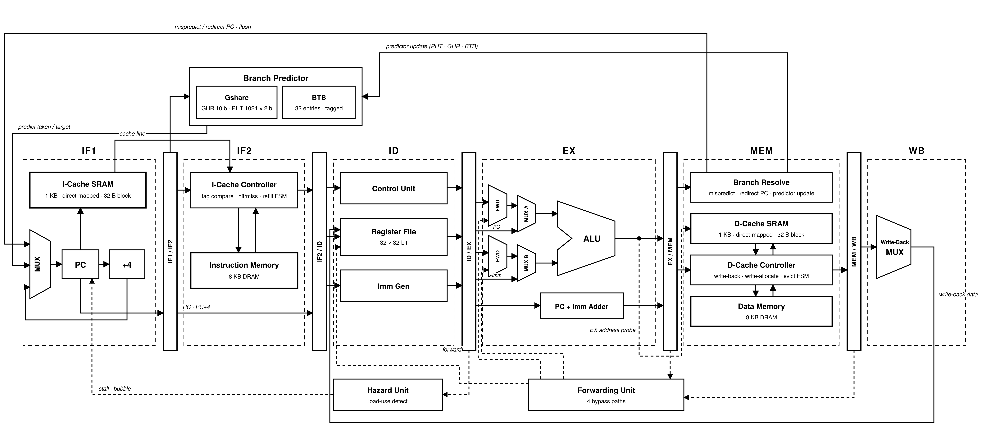

# RV32IM 6-Stage Pipelined Processor with Level 1 Instruction/Data Caches and a Gshare + BTB Dynamic Branch Predictor

A synthesizable RTL implementation of a 32-bit RISC-V processor implementing the **RV32I** base integer ISA and the **RV32M** multiply/divide extension. The core is a six-stage in-order pipeline with full operand forwarding, a load-use interlock, split direct-mapped L1 instruction and data caches (the data cache is write-back / write-allocate), and a Gshare + Branch Target Buffer dynamic branch predictor. The design is written in Verilog-2001 and is verified module-by-module with self-checking testbenches built around reference golden models and scoreboards.

<p align="center">
  
</p>

---

## Table of Contents

- [1. Pipeline overview](#1-pipeline-overview)
  - [1.1 Per-stage datapath](#11-per-stage-datapath)
  - [1.2 Control encodings](#12-control-encodings)
  - [1.3 What each pipeline register carries](#13-what-each-pipeline-register-carries)
- [2. Supported instruction set (RV32I + RV32M)](#2-supported-instruction-set-rv32i--rv32m)
- [3. Immediate Data Generation](#3-immediate-data-generation)
- [4. Why the fetch stage is split into two, but the memory stage is not](#4-why-the-fetch-stage-is-split-into-two-but-the-memory-stage-is-not)
  - [4.1 The instruction cache forces IF into two stages](#41-the-instruction-cache-forces-if-into-two-stages)
  - [4.2 The memory stage does not need splitting](#42-the-memory-stage-does-not-need-splitting)
  - [4.3 Branch resolution in MEM and its consequence](#43-branch-resolution-in-mem-and-its-consequence)
- [5. Hazards, forwarding, and interlocks](#5-hazards-forwarding-and-interlocks)
  - [5.1 The four forwarded hazards](#51-the-four-forwarded-hazards)
  - [5.2 The load-use interlock (stall + bubble)](#52-the-load-use-interlock-stall--bubble)
- [6. Memory hierarchy: direct-mapped L1 caches](#6-memory-hierarchy-direct-mapped-l1-caches)
  - [6.1 Geometry and address decomposition](#61-geometry-and-address-decomposition)
  - [6.2 Instruction cache: controller, states, and data flow](#62-instruction-cache-controller-states-and-data-flow)
  - [6.3 Data cache: controller, states, and data flow (write-back / write-allocate)](#63-data-cache-controller-states-and-data-flow-write-back--write-allocate)
  - [6.4 Backing-memory latency](#64-backing-memory-latency)
- [7. Dynamic branch prediction: Gshare + Branch Target Buffer (BTB)](#7-dynamic-branch-prediction-gshare--branch-target-buffer-btb)
  - [7.1 Gshare: GHR and PHT](#71-gshare-ghr-and-pht)
  - [7.2 Branch Target Buffer: recognition and target](#72-branch-target-buffer-recognition-and-target)
  - [7.3 Prediction data flow (IF2)](#73-prediction-data-flow-if2)
  - [7.4 Resolution and update data flow (MEM)](#74-resolution-and-update-data-flow-mem)
  - [7.5 Committed history and the threaded PHT index](#75-committed-history-and-the-threaded-pht-index)
  - [7.6 Cycle-behavior summary](#76-cycle-behavior-summary)
- [8. Performance analysis](#8-performance-analysis)
  - [8.1 Ideal pipeline](#81-ideal-pipeline)
  - [8.2 The CPI model](#82-the-cpi-model)
  - [8.3 Forwarding](#83-forwarding)
  - [8.4 Branch prediction](#84-branch-prediction)
  - [8.5 Caches: average memory access time](#85-caches-average-memory-access-time)
  - [8.6 Combined effect](#86-combined-effect)
- [9. Verification methodology](#9-verification-methodology)
- [10. Building and running](#10-building-and-running)
- [11. Known simplifications and future work](#11-known-simplifications-and-future-work)

---

## 1. Pipeline overview

The pipeline has **six stages**:

```
IF1  ->  IF2  ->  ID  ->  EX  ->  MEM  ->  WB
```

Instruction fetch is split into two physical stages (**IF1** and **IF2**) to accommodate a *synchronous-read* instruction cache; the reasoning is developed in Section 4. The remaining stages, decode (**ID**), execute (**EX**), memory (**MEM**), and write-back (**WB**), are the classic RISC pipeline stages. Branch resolution and the data-cache access both live in **MEM**.

The stage boundaries are registered by the pipeline latches `if1_if2`, `if_id`, `id_ex`, `ex_mem`, and `mem_wb`. Under ideal conditions the pipeline sustains a throughput of **one instruction retired per cycle (IPC = 1)**; the per-instruction latency from fetch to write-back is **six cycles**.

### 1.1 Per-stage datapath

**IF1 (`if1_stage`).** Holds the architectural program counter (`ff PC`), a `PC+4` adder, the next-PC selection mux, and the instruction-cache SRAM (`icache_mem`). The next-PC mux is a strict priority network:

```
pc_next = mispredict    ? redirect_pc     // MEM correct-path redirect
        : predict_taken ? predict_target  // IF2 speculative redirect
        :                 pc + 4;         // sequential
```

The SRAM is *indexed* here using `pc_current[9:5]`, but because the cache read is registered, the *data* becomes available only in the next stage. `halt_pc = en_low | bubble | cache_miss` freezes the PC on a decode-side halt, a load-use bubble, or any cache stall.

**IF2 (`if2_stage`).** Contains the instruction-cache controller FSM (`icache_ctrl`) and the backing instruction memory (`instrmem`). The controller compares the tag delivered by the SRAM against `pc[12:10]`, produces the fetched instruction word (or a NOP on a miss), asserts `cache_miss` to stall on a miss, and drives the refill machinery. The predictor is queried with the IF2 program counter (`pc_IF1IF2`), so the prediction is logically made in IF2.

**ID (`id_stage`).** Register file (`regfile`), immediate generator (`immgen`), and the main decoder (`controlunit`). The register file has two asynchronous read ports (with a hardwired `x0 = 0`) and one synchronous write port. Because reads are combinational and writes are clocked, a value written by WB in the same cycle it is read in ID is bypassed by the forwarding network (Section 5, hazard 3). The decoder emits every control signal for the downstream stages; on a `bubble` it emits an all-zero (NOP) control word.

**EX (`ex_stage`).** The ALU, the two operand-select muxes (register/PC for the A input, register/immediate for the B input), the operand-forwarding muxes, and the `PC + immediate` adder. The forwarded `rs2` value produced here is what a store later writes to memory, and the effective address for a load/store (`base + offset`) is computed here, a timing property that matters for the data cache (Section 4.2).

**MEM (`mem_stage`).** The L1 data cache (`dcache_mem` + `dcache_ctrl`) and its backing DRAM (`dmem`), plus **branch resolution and the branch-predictor update**. The actual branch direction (`ALUResult[0]`) is known here, as is the misprediction condition, the correct redirect PC, the PHT/GHR update, and the BTB install.

**WB (`wb_stage`).** A 4-to-1 write-back mux selecting among the loaded data, the ALU result, the immediate, and `PC+4`, feeding the register-file write port.

### 1.2 Control encodings

Two 2-bit selectors steer the datapath and are produced by `controlunit`:

| `pcSEL` | next-PC source | used by |
|---|---|---|
| `00` | `PC + 4` | sequential |
| `01` | `ALUResult` | JALR (target = `rs1 + imm`, LSB cleared) |
| `10` | `PC + Imm` | JAL |
| `11` | branch (taken → `PC + Imm`, else `PC + 4`) | conditional branches |

| `regSEL` | write-back source |
|---|---|
| `00` | data-memory load result |
| `01` | ALU result |
| `10` | immediate (LUI) |
| `11` | `PC + 4` (JAL/JALR link) |

The ALU control field is 5 bits, widened from 4 to admit the eight M-extension operations. The branch comparators (`equal`, `not_equal`, `SLT`, `SLTU`, `greater_equal`, `greater_equal_sign`) return their boolean result in bit 0 of the ALU output, so **`ALUResult[0]` is the branch-taken signal** consumed in MEM.

### 1.3 What each pipeline register carries

Beyond the usual datapath/control fields, two predictor fields are threaded from fetch to MEM so that the branch predictor can be updated correctly (Section 7):

- `pred_next_pc[31:0]`, the next-PC that fetch committed to for this instruction (predicted target if predicted-taken, else `PC+4`).
- `pht_index[9:0]`, the Pattern History Table index used to predict this instruction.

Both ride through `if_id → id_ex → ex_mem` into `mem_stage`.

---

## 2. Supported instruction set (RV32I + RV32M)

All 45 instructions listed below are decoded by `controlunit` and executed by the datapath: the 37 non-system RV32I instructions plus the 8 RV32M instructions. `ecall`, `ebreak` and `fence` are not implemented, and there is no CSR/privileged state. A non-standard all-ones word (`0xFFFFFFFF`) is decoded as a custom **HALT** that freezes the PC, used to terminate test programs.

**Integer register-immediate (9)**
`ADDI`, `SLTI`, `SLTIU`, `XORI`, `ORI`, `ANDI`, `SLLI`, `SRLI`, `SRAI`

**Integer register-register (10)**
`ADD`, `SUB`, `SLL`, `SLT`, `SLTU`, `XOR`, `SRL`, `SRA`, `OR`, `AND`

**M extension: multiply / divide (8)**
`MUL`, `MULH`, `MULHSU`, `MULHU`, `DIV`, `DIVU`, `REM`, `REMU`

**Control transfer (8)**
`JAL`, `JALR`, `BEQ`, `BNE`, `BLT`, `BGE`, `BLTU`, `BGEU`

**Loads (5)**
`LB`, `LH`, `LW`, `LBU`, `LHU`

**Stores (3)**
`SB`, `SH`, `SW`

**Upper-immediate (2)**
`LUI`, `AUIPC`

The division and remainder edge cases follow the RISC-V specification: divide-by-zero returns all ones for `DIV`/`DIVU` and the dividend for `REM`/`REMU`, and the signed overflow case `INT_MIN / -1` returns `INT_MIN` with a remainder of zero. Each case is checked explicitly by the ALU testbench.

Sub-word load extraction (sign/zero extension) and sub-word store merging are performed inside the data-cache controller, operating on the cached 256-bit block (Section 6.3).

---

## 3. Immediate Data Generation

`immgen` reconstructs the sign-extended immediate for every instruction format from the raw instruction word using an opcode `casex`:

- **I-type** (`ADDI…`, loads, `JALR`): `{{21{i[31]}}, i[30:20]}`
- **S-type** (stores): `{{21{i[31]}}, i[30:25], i[11:7]}`
- **B-type** (branches): `{{20{i[31]}}, i[7], i[30:25], i[11:8], 1'b0}` (implicit LSB 0)
- **U-type** (`LUI`, `AUIPC`): `{i[31:12], 12'b0}`
- **J-type** (`JAL`): `{{12{i[31]}}, i[19:12], i[20], i[30:25], i[24:21], 1'b0}`

The B-type and J-type immediates carry an implicit zero in bit 0 because branch and jump targets are 2-byte aligned, which is why their encodings can cover twice the range of the raw immediate field. The unit is purely combinational and is checked against a golden sign-extension model over directed corner cases and 500 randomized vectors.

---

## 4. Why the fetch stage is split into two, but the memory stage is not

### 4.1 The instruction cache forces IF into two stages

The instruction cache SRAM (`icache_mem`) is a **synchronous-read** memory: the index is presented on one clock edge and the line comes out registered on the next. This is deliberate, since synchronous-read SRAM and FPGA block RAM behave this way, and it keeps the array read out of the combinational critical path.

The address the instruction cache needs is the program counter, and the PC is produced in the same front-end stage that consumes the fetched instruction. A single-cycle IF stage would therefore require either a combinational-read cache, which lengthens the critical path, or a stall on every fetch while the instruction arrives a cycle late. Splitting fetch resolves this:

- **IF1** presents `pc_current[9:5]` to the SRAM, launching the read, and computes `PC+4`.
- **IF2** receives the registered line one cycle later, performs tag comparison and hit detection in `icache_ctrl`, and delivers the instruction word.

The result is a fully pipelined front end that sustains one fetch per cycle from a synchronous-read cache, at the cost of one extra cycle of *fetch latency*, which manifests as a one-slot-deeper misprediction pipe rather than reduced throughput.

### 4.2 The memory stage does not need splitting

The data cache SRAM (`dcache_mem`) is also synchronous-read, so the same argument would appear to apply. It does not, because **the address for a load/store is produced one stage early, in EX**. The effective address `base + offset` is computed by the EX-stage ALU, and the data cache is indexed with the *un-staged* EX ALU result crossing the EX/MEM boundary:

```verilog
dcache_mem DCACHE(
    ...
    .rd_index(ALUREsult_direct[9:5]),   // ALUResult_EX, not the staged copy
    ...
);
```

The synchronous cache read is launched from EX and the line lands in MEM exactly when the controller requires it. EX serves the data cache in the same role IF1 serves the instruction cache: the stage that supplies the address a cycle early. That cycle is already provided by the existing EX/MEM boundary, so no additional MEM sub-stage is required. Splitting MEM would add pipeline depth, and therefore a deeper branch penalty, for no benefit.

The controller (`dcache_ctrl`) uses the *staged* address (`ALUResult_in`, from EX/MEM) for tag comparison and hit/miss logic, so the probe index (from EX) and the tag resolution (from EX/MEM) are correctly aligned across the boundary.

### 4.3 Branch resolution in MEM and its consequence

Branches are resolved in **MEM**, not EX. The comparator result `ALUResult[0]` is available at the end of EX, but the redirect is taken in MEM, where `mem_stage` computes `redirect_pc` and `mispredict`. This keeps branch operands on the same forwarding paths as ordinary ALU operands and unifies every PC redirect at a single point.

The cost is a deeper misprediction penalty: with a branch in MEM, the four younger instructions occupying EX, ID, IF2 and IF1 are on the wrong path and must be flushed, giving a **4-cycle** penalty per misprediction. This is why a dynamic branch predictor is valuable in this design; it targets the largest CPI adder in the machine (Section 7).

---

## 5. Hazards, forwarding, and interlocks

The pipeline resolves all read-after-write (RAW) data hazards by forwarding, and covers the one hazard forwarding cannot (load-use) with a single-cycle interlock. `forwardunit` is purely combinational; `hazardunit` produces only the load-use bubble, since branch flushes are generated in MEM (Section 7).

### 5.1 The four forwarded hazards

The forwarding unit implements four distinct bypass paths.

**Hazard 1: EX/MEM → EX (distance-1 RAW into an ALU operand).**
The producer is one instruction ahead, sitting in EX/MEM; its result is forwarded into the ALU input of the consumer in EX. Encoded as `EXMEM` (`2'b01`).

```asm
add  x1, x2, x3      # x1 produced, now in EX/MEM
sub  x4, x1, x5      # needs x1 in EX  ->  forward from EX/MEM
```

**Hazard 2: MEM/WB → EX (distance-2 RAW into an ALU operand).**
The producer is two instructions ahead and has reached MEM/WB; its result is forwarded into EX. Encoded as `MEMWB` (`2'b10`). Hazard 1 takes priority over hazard 2 when both match, so the nearer and newer value wins.

```asm
add  x1, x2, x3      # x1 produced
or   x6, x7, x8      # unrelated filler
sub  x4, x1, x5      # x1 now in MEM/WB  ->  forward from MEM/WB
```

**Hazard 3: MEM/WB → ID (the write-back to decode bypass).**
The register file writes synchronously and reads asynchronously, so an instruction in ID reading a register being written by WB in the same cycle would otherwise read the stale value. The forwarding unit detects `MEM/WB.rd == IF/ID.rs1/rs2` and substitutes the write-back datum directly in ID.

```asm
add  x1, x2, x3      # I1
addi x6, x0, 1       # I2
addi x7, x0, 2       # I3
and  x4, x1, x5      # I4 is in ID the cycle I1 is in WB  ->  bypass into ID
```

**Hazard 4: MEM/WB → MEM (store-data forwarding).**
A store writes the value held in its `rs2`. When that value is produced by an instruction that becomes available only as the store reaches MEM, the canonical case being a load feeding a store, it is injected into the store's write-data path in MEM via `mem_rs2_fwrd`, which matches `MEM/WB.rd == EX/MEM.rs2`.

```asm
lw   x1, 0(x5)       # load into x1
sw   x1, 0(x6)       # store x1: loaded value forwarded MEM/WB -> MEM store path
```

### 5.2 The load-use interlock (stall + bubble)

Forwarding cannot cover a load feeding an immediately dependent instruction, because the load's data is available only after MEM, too late to forward into the dependent instruction's EX. `hazardunit` detects this case:

```verilog
bubble = id_ex_memRE && (id_ex_rd != 0) &&
         (id_ex_rd == if_id_rs1 || id_ex_rd == if_id_rs2);
```

When asserted, `bubble` freezes the PC and the IF1/IF2 and IF/ID registers (a **stall**), and forces the control unit to emit a NOP into ID/EX (a **bubble**), delaying the dependent instruction by one cycle. After that cycle the load has reached MEM/WB and the value is supplied by ordinary forwarding.

```asm
lw   x1, 0(x2)       # load
add  x3, x1, x4      # dependent -> 1-cycle load-use bubble, then forwarded
```

This is the only RAW situation that costs a cycle; all others are fully bypassed.

---

## 6. Memory hierarchy: direct-mapped L1 caches

Both L1 caches are **1 KB, direct-mapped, with 32-byte (8-word) blocks**, giving **32 lines**, and sit in front of 8 KB backing memories. The instruction cache is read-only; the data cache is **write-back with write-allocate**.

Each cache consists of two cooperating modules: a **synchronous-read SRAM** holding the lines (`icache_mem` / `dcache_mem`), and a **controller FSM** (`icache_ctrl` / `dcache_ctrl`) that performs tag comparison, drives the hit/miss decision, sequences refills and evictions, and produces the stall signal.

### 6.1 Geometry and address decomposition

With a 1 KB cache and 32-byte blocks:

```
lines = cache_size / block_size = 1024 / 32 = 32          -> 5 index bits
block = 32 B = 8 words x 4 B     -> 3 word-offset bits + 2 byte-offset bits
backing memory = 8 KB            -> 13 address bits [12:0]
tag = remaining high bits        -> [12:10]  (3 bits)
```

An address is split as:

```
 12      10 9        5 4    2 1   0
+----------+----------+------+-----+
|  tag(3)  | index(5) | word | byte|
+----------+----------+------+-----+
```

Because the backing memory (8 KB) is eight times the cache (1 KB), each of the 32 lines can hold any of `8 KB / 1 KB = 8` distinct blocks, that is, 8 possible tag values per index. Two addresses map to the same line exactly when they share `addr[9:5]` and differ in `addr[12:10]`; the data-cache test programs use this property to force conflict misses and dirty evictions.

Cache line formats:

- **I-cache line, 260 bits:** `{ valid(1), tag(3), data(256) }`. Storage is `32 × 260` bits; the 256-bit data field across 32 lines is exactly 1 KB of instructions.
- **D-cache line, 261 bits:** `{ valid(1), dirty(1), tag(3), data(256) }`. The extra **dirty** bit is what makes the write-back policy possible.

Both SRAMs are synchronous-read with a **write-first bypass**: if the same index is written and read on one edge, the read returns the just-written line. This is required by the refill sequence, since it guarantees a block written into a line during a refill is visible to the next access to that line without an additional cycle, so the fill and the resume overlap rather than serialize.

### 6.2 Instruction cache: controller, states, and data flow

`icache_ctrl` is a three-state FSM: **NORUN → IDLE → REFILL**. Its combinational block derives, every cycle, the block-aligned fetch address (`block_base_addr = {pc[31:5], 5'b0}`), the requested word offset (`pc[4:2]`), the tag (`pc[12:10]`), and `hit = valid_cache && (tag_cache == pc[12:10])`. Its outputs are `Instr` (the word handed to decode), `cache_miss` (the front-end stall), `imemRE` and `imem_addr` (the backing-memory read request), and the cache-write group `cacheWE` / `cache_wr_index` / `cache_refill`.

**NORUN** is entered on reset and lasts one cycle. It guarantees the first state the controller acts in is IDLE rather than REFILL, preventing the controller from writing the undefined line the SRAM emits on the first cycle. It drives `Instr = NOP`, `cache_miss = 0`, `imemRE = 0`, `cacheWE = 0`, then advances unconditionally to IDLE.

**Fetch that hits (zero stall).**

1. *Cycle T (IF1).* `pc_current` is the address being fetched. `icache_mem` is indexed with `pc_current[9:5]`, launching the synchronous read. The PC advances to `PC+4`, or to a redirect/prediction target, for the next cycle.
2. *Cycle T+1 (IF2).* The SRAM presents the registered line on `cache_data` and `icache_ctrl` is in **IDLE**. On a hit it selects the requested word from the 8-word line, `Instr = block_cache[pc[4:2]*32 +: 32]`, drives `cache_miss = 0`, `imemRE = 0`, `cacheWE = 0`, and the instruction is latched into IF/ID at the end of the cycle. The FSM remains in IDLE. No stall is incurred, and fetch sustains one instruction per cycle.

**Fetch that misses (one stall cycle).**

1. *Cycle T (IF1).* As above: the SRAM is indexed with `pc_current[9:5]` and the read is launched.
2. *Cycle T+1 (IF2), IDLE, `hit == 0`.* The controller cannot supply the instruction, so it injects a NOP (`Instr = NOP`) into decode and asserts **`cache_miss = 1`**. That stall freezes the PC and the IF1/IF2 and IF/ID registers via `halt_pc`/`stall`, so no younger fetch is lost. It simultaneously asserts **`imemRE = 1`** and drives **`imem_addr = block_base_addr`**, launching a read of the full 32-byte block from `instrmem`. The FSM transitions **IDLE → REFILL**.
3. *Cycle T+2 (IF2), REFILL.* `instrmem` presents the 256-bit block on `imem_data`. The controller performs two actions in the same cycle. First it forwards the requested word directly to decode, `Instr = imem_data[pc[4:2]*32 +: 32]`, and drops `cache_miss = 0`, so the missing instruction is delivered without waiting for the fill to complete. Second it asserts **`cacheWE = 1`**, `cache_wr_index = pc[9:5]` and `cache_refill = {1'b1, tag, imem_data}`, so the line is written into `icache_mem` on the next edge. The write-first bypass makes the block resident and visible immediately afterward. The FSM returns **REFILL → IDLE**.

The net cost of an instruction-cache miss is therefore **one stall cycle**, the IDLE-miss cycle; the REFILL cycle performs useful work, delivering the instruction and installing the line in parallel. Every subsequent fetch landing in the same 32-byte block hits, which is where the 8-word block size pays off: one compulsory miss covers up to seven neighbouring hits.

### 6.3 Data cache: controller, states, and data flow (write-back / write-allocate)

`dcache_ctrl` is a four-state FSM: **NORUN → IDLE → {EVICT, REFILL}**, implementing write-back with write-allocate. Its combinational block decomposes the staged address (`addr = ALUResult_in`) into `tag_addr = addr[12:10]`, `index_addr = addr[9:5]`, `word_offset = addr[4:2]` and `byte_offset = addr[1:0]`, and derives `block_base_addr` (the requested block, aligned) and `evict_addr = {tag_cache, index_addr, 5'b0}` (the victim's own aligned address). From the resident line it takes `valid_cache`, `dirty_cache` and `tag_cache`, and from those forms `hit = valid_cache && (tag_cache == tag_addr)` and `evict = valid_cache && dirty_cache`. `mem_op = dmemRE_in || dmemWE_in`.

Two helper functions perform the narrow-access work. `load_data(block, word, byte, mode)` extracts and sign- or zero-extends the addressed byte, half-word or word for `LB`/`LH`/`LW`/`LBU`/`LHU`. `write_block(block, word, byte, mode, store_data)` splices the new byte, half-word or word into the correct lane of a 256-bit block for `SB`/`SH`/`SW`, a read-modify-write on the block. The backing DRAM (`dmem`) sees only whole 256-bit block transfers; all sub-word handling resides in the controller.

A store's data (`st_fwrd_data`) is captured into **`st_fwrd_data_latch`** while the FSM is in IDLE, so the value to be written survives a multi-cycle miss sequence and remains available to `write_block` during REFILL.

The controller outputs are `data` (the load result forwarded toward WB), `cache_miss` (the pipeline stall), `dmemRE_out` / `dmemWE_out` / `dmem_addr` / `dmem_wr_data` (the backing-memory access), and the cache-write group `cacheWE` / `cache_wr_index` / `cache_refill`.

**Read hit (zero stall).**

1. *Cycle T (EX).* The ALU computes `addr = base + offset`. `dcache_mem` is indexed with the un-staged `ALUResult_EX[9:5]`, launching the synchronous read a cycle early.
2. *Cycle T+1 (MEM), IDLE, `mem_op & hit`.* The line is present on `cache_data`. For a read (`dmemRE_in`) the controller drives `cacheWE = 0` and `dmemRE_out = dmemWE_out = 0`, leaving the DRAM untouched, and produces `data = load_data(block_cache, word_offset, byte_offset, dmemMode)` with `cache_miss = 0`. The value flows `data → memData → MEM/WB → WB` write-back mux (`regSEL = 00`). The FSM remains in IDLE.

**Write hit (zero stall, sets dirty).**

1. The EX probe is as above.
2. *Cycle T+1 (MEM), IDLE, `mem_op & hit`, write.* The controller asserts **`cacheWE = 1`** and builds the merged line `cache_refill = {valid=1, dirty=1, tag_addr, write_block(block_cache, …, st_fwrd_data)}`, marking it **dirty**. On the next edge `dcache_mem` writes that line at `cache_wr_index = index_addr`. The DRAM is not accessed: under write-back a store hit mutates only the cached copy, and the backing memory is updated only when the line is evicted. `cache_miss = 0`, so no stall occurs.

**Clean miss: write-allocate refill (one stall cycle).** Clean here means the resident line is either invalid, or valid with a different tag but not dirty, so nothing must be written back before refilling.

1. *Cycle T+1 (MEM), IDLE, `mem_op & !hit & !evict`.* Assert **`cache_miss = 1`** to stall, hold `cacheWE = 0`, assert **`dmemRE_out = 1`** with `dmem_addr = block_base_addr`, launching a read of the requested block from DRAM. The store data is latched into `st_fwrd_data_latch`. FSM **IDLE → REFILL**.
2. *Cycle T+2 (MEM), REFILL.* `block_dmem` holds the block. Drop `cache_miss = 0` and assert **`cacheWE = 1`**. On a **read** miss, `data = load_data(block_dmem, …)` is forwarded to WB and `cache_refill = {1, 0, tag_addr, block_dmem}` installs the line **clean**. On a **write** miss, write-allocate applies: `cache_refill = {1, 1, tag_addr, write_block(block_dmem, …, st_fwrd_data_latch)}` installs the block with the store already merged and the line marked **dirty**. FSM **REFILL → IDLE**. Cost: **1 stall cycle**.

**Dirty miss: evict then refill (two stall cycles).** The resident line is valid and dirty, so its contents must be written back before its slot can be reused.

1. *Cycle T+1 (MEM), IDLE, `mem_op & !hit & evict`.* Assert **`cache_miss = 1`** and begin the write-back: **`dmemWE_out = 1`**, `dmem_addr = evict_addr` (the victim's aligned address), `dmem_wr_data = block_cache`, so the whole dirty block is written to DRAM on the coming edge. `dmemRE_out = 0`. Store data is latched. FSM **IDLE → EVICT**.
2. *Cycle T+2 (MEM), EVICT.* The victim has been written back. `cache_miss` remains 1, holding the stall. The DRAM is turned around to fetch the wanted block: **`dmemRE_out = 1`**, `dmem_addr = block_base_addr`, `dmemWE_out = 0`. FSM **EVICT → REFILL**.
3. *Cycle T+3 (MEM), REFILL.* Identical to the clean-miss REFILL: forward the load result on a read or merge the store on a write, install the line with `cacheWE = 1` (clean for a read, dirty for a write), and drop `cache_miss = 0`. FSM **REFILL → IDLE**. Cost: **2 stall cycles**, the IDLE-miss and EVICT cycles.

Throughout a multi-cycle miss, the offending load/store is held in MEM by `cache_miss`, which stalls every upstream stage. Because the D-cache index comes from the frozen EX result, the same line is re-probed each cycle, so the controller observes a stable `cache_data` / `hit` / `evict` picture. The stalled instruction must also not write the register file while it waits, so `mem_stage` gates its write-back controls to zero on `cache_miss`, injecting a NOP into WB and preventing a spurious commit during the stall.

### 6.4 Backing-memory latency

The backing memories (`instrmem`, `dmem`) are modeled as single-cycle behavioral arrays, so the miss penalties above (1 to 2 cycles) reflect only the controller's FSM transition overhead rather than a realistic DRAM latency of tens to hundreds of cycles. The cache structure (tags, valid and dirty bits, block granularity, write-back with write-allocate, and eviction) is complete; only the DRAM timing is idealized. The AMAT analysis in Section 8 is expressed so a realistic penalty can be substituted directly.

---

## 7. Dynamic branch prediction: Gshare + Branch Target Buffer (BTB)

Because branches resolve in MEM, a misprediction costs a 4-cycle flush. To recover most of that cost, the core predicts branch **direction** and **target** in the fetch stage and flushes only when the prediction proves wrong. Two structures cooperate, wrapped by `branch_predictor`:

- **Gshare** (`gshare`) supplies the **direction**: whether a conditional branch will be taken.
- **Branch Target Buffer / BTB** (`btb`) supplies **recognition and target**: whether the PC being fetched is a known control-transfer instruction, and if so, its destination.

Neither structure is sufficient alone. The BTB provides the address to redirect to, which is required before any redirect can occur, while Gshare provides the taken/not-taken decision for conditional branches. A prediction fires only when both indicate a taken transfer.

### 7.1 Gshare: GHR and PHT

- **GHR (Global History Register), 10 bits.** A shift register holding the outcomes (1 = taken, 0 = not-taken) of the last 10 committed conditional branches. Global history allows the predictor to learn correlations between distinct branches, where the outcome of recent branches is predictive of the current one.
- **PHT (Pattern History Table), 1024 entries of 2-bit saturating counters** (2^10 entries, 2048 bits). Each counter encodes a confidence level: `00` strongly not-taken, `01` weakly not-taken, `10` weakly taken, `11` strongly taken. The MSB is the prediction. The two-bit hysteresis means a single anomalous outcome, such as the one non-taken iteration at a loop exit, does not immediately invert a well-established prediction. Counters reset to `01`, weakly not-taken, so an unseen branch predicts not-taken, matching the sequential fall-through default.
- **Index:** `pht_index = GHR ^ pc[11:2]`. XOR-ing global history with the branch address, the gshare hash, distributes different (history, PC) contexts across different counters, preventing two branches, or the same branch under two different histories, from aliasing onto and thrashing a single counter. `pc[11:2]` is used because instructions are 4-byte aligned, so `pc[1:0]` is always zero and carries no information.
- **Prediction output:** `pht_taken = PHT[pht_index][1]`, a purely combinational read.

### 7.2 Branch Target Buffer: recognition and target

The BTB is a small tagged cache of control-transfer instructions. Each of its **32 entries** holds `{ valid, is_cond, tag(25), target(32) }`, that is 59 bits per entry, 236 B of total storage of which 128 B is target payload.

- **Index** `pc[6:2]` selects one of 32 entries; **tag** `pc[31:7]` is stored and compared, giving `hit = valid[index] && (tag[index] == pc[31:7])`. The tag check is what makes the target trustworthy: a hit means this exact PC was previously a taken transfer, so the stored `target` is the address it went to. Without the tag, two different PCs sharing `pc[6:2]` would return each other's targets.
- **`is_cond`** records whether the entry is a conditional branch, whose direction must come from the PHT, or an unconditional jump, which is taken whenever recognized. This is why the BTB, not the PHT alone, is consulted for direction: an unconditional `JAL` is predicted taken on a BTB hit regardless of any counter value.
- **`target`** is the resolved destination: `PC + imm` for a taken branch or `JAL`, `rs1 + imm` for a `JALR`.

### 7.3 Prediction data flow (IF2)

The predictor is instantiated at the top level but driven by the **IF2** program counter (`pc_IF1IF2`), so a prediction is produced in IF2 for the instruction being fetched there. The combinational prediction is:

```verilog
taken        = enable_bp && btb_hit && (!btb_is_cond || pht_taken);
target_out   = btb_target;
pred_next_pc = taken ? btb_target : PC_4;      // PC_4 == pc_IF1IF2 + 4
```

with `enable_bp = !cache_miss && !bubble_HU` gating the predictor off during any stall, so it never redirects a frozen front end. A taken prediction proceeds as follows:

1. *Cycle T (IF1).* PC = A is being fetched from the instruction cache.
2. *Cycle T+1 (IF2).* `pc_IF1IF2 = A`. In parallel, Gshare computes `pht_index = GHR ^ A[11:2]` and reads `pht_taken`, while the BTB indexes `A[6:2]`, compares its tag against `A[31:7]`, and produces `btb_hit`, `btb_target` and `btb_is_cond`. If this resolves to `taken`, meaning a BTB hit that is either unconditional or PHT-taken, three actions occur simultaneously:
- **The PC is redirected.** `predict_taken` and `predict_target = btb_target` feed IF1's next-PC mux, so the fetch in cycle T+2 is the predicted target rather than `A+4`.
- **The wrong-path fetch is squashed.** IF1 had already fetched `A+4` sequentially during cycle T+1, and that instruction lies on the wrong path. `predict_squash` flushes the IF1/IF2 register, and the instruction-cache SRAM emits a NOP on the `predict_taken` cycle so no stale sequential word reaches decode. This costs exactly **one bubble**.
- **The prediction is recorded for later checking.** `pred_next_pc`, the address fetch committed to, and `pht_index`, the counter that produced the decision, are latched into IF/ID alongside branch A and threaded down `id_ex → ex_mem → mem_stage`.

If the prediction is not-taken, whether from a BTB miss or a conditional whose counter reads not-taken, nothing is redirected or squashed, `pred_next_pc = A+4`, and fetch continues sequentially at zero cost.

The next-PC priority in IF1, `mispredict > predict_taken > PC+4`, guarantees that when MEM signals a correct-path redirect in the same cycle IF2 makes a speculative prediction, the older and known-correct MEM redirect wins.

### 7.4 Resolution and update data flow (MEM)

When the control instruction reaches MEM its operands have passed through the ALU, so the true outcome is available:

```verilog
is_ctrl      = (pcSEL==11) || (pcSEL==10) || (pcSEL==01);      // branch, JAL, JALR
branch_taken = (pcSEL==11) ? ALUResult[0] : (is_ctrl ? 1 : 0); // jumps always taken
redirect_pc  = (pcSEL==01) ? ALUResult             // JALR: (rs1+imm)&~1
             : (pcSEL==10) ? PC_Imm                // JAL:  pc+imm
             : (pcSEL==11 && ALUResult[0]) ? PC_Imm // taken branch: pc+imm
             :               PC_4;                  // not-taken / fall-through
mispredict   = is_ctrl && (redirect_pc != pred_next_pc);
```

The check is deliberately uniform. `redirect_pc` is the address the instruction should have gone to, and `pred_next_pc`, threaded from IF2, is the address fetch actually went to. A single inequality catches every failure mode: wrong direction, a stale `JALR` target, and a cold branch not yet resident in the BTB, which predicted fall-through. On `mispredict`, `flush_MEM` squashes the four wrong-path instructions in IF1/IF2, IF/ID, ID/EX and EX/MEM, and IF1's PC is redirected to `redirect_pc`. On a correct prediction nothing is flushed and the speculative path continues.

Any control instruction that reaches MEM is on the correct path, since an older misprediction would have flushed it earlier, so it always trains the predictor. The two structures are trained on **different conditions**:

- **PHT and GHR update only for conditional branches** (`update_en && update_is_cond`). The 2-bit counter at the threaded `pht_index` is saturating-incremented if `branch_taken` and decremented otherwise, and `branch_taken` is shifted into the GHR (`GHR <= {GHR[8:0], branch_taken}`). Unconditional jumps carry no directional information and are excluded from the history, since shifting them into the GHR would add noise to conditional-branch prediction.
- **The BTB installs on any taken control transfer** (`update_btb = is_ctrl && branch_taken`). Taken branches, `JAL`s and `JALR`s all deposit `{valid=1, is_cond=(pcSEL==11), tag=update_pc[31:7], target=redirect_pc}` at `update_pc[6:2]`, where `update_pc = PC_4_in - 4` reconstructs the instruction's own PC. A branch that is never taken never enters the BTB, so it never predicts taken and never consumes an entry.

### 7.5 Committed history and the threaded PHT index

The GHR is **committed** rather than speculative: it advances only when a branch resolves in MEM, in program order. This removes an entire class of complexity, since there is no speculative-history checkpoint to snapshot and no repair to perform on a misprediction; the flushed younger instructions never reached MEM and therefore never modified the GHR. The trade-off is slightly staler history at prediction time in exchange for a simpler and verifiable update path.

Committed history creates one subtlety the design must handle. Between the cycle a branch is predicted (IF2) and the cycle it commits (MEM), a span of several cycles, the GHR can change because older branches ahead of it in the pipeline commit in the interim. Recomputing the index from the GHR value present at commit would therefore train the wrong counter. For this reason `pht_index` is captured at prediction time and threaded down the pipeline with the branch, so the MEM-stage update writes back to the counter that produced the prediction regardless of how the GHR has since moved. This threaded index is what makes committed-history Gshare correct in a pipeline with a multi-cycle predict-to-commit distance.

### 7.6 Cycle-behavior summary

| Event | Penalty |
|---|---|
| Correct not-taken prediction | 0 bubbles |
| Correct taken prediction (BTB hit + PHT taken, correct) | 1 bubble |
| Any misprediction (wrong direction, wrong/stale target, or cold branch) | 4-cycle flush |

Cold branches and returns, specifically a `JALR` whose target changes per call, are the main residual mispredictors. A Return Address Stack is the natural next structure to add.

---

## 8. Performance analysis

Figures below are expressed in standard pipeline-performance terms. The baseline for comparison is the same pipeline with each feature removed: a stall-on-every-hazard, predict-not-taken, cacheless machine of equal depth.

### 8.1 Ideal pipeline

At steady state the pipeline retires one instruction per cycle:

```
IPC_ideal = 1        CPI_ideal = 1
```

with a per-instruction latency of 6 cycles. Pipelining the datapath into 6 stages shortens the clock period from the single-cycle critical path (fetch, decode, register read, ALU, memory and write-back in series) to approximately the slowest single stage, an ALU operation or a cache access, so the clock-frequency gain approaches the stage count while CPI stays near 1. Realized throughput is:

```
Throughput = f_clk / CPI     (instructions / second)
```

Every mechanism below therefore serves to keep CPI close to 1 without lengthening the critical path.

### 8.2 The CPI model

Hazards add stall cycles, so achieved CPI is:

```
CPI = 1 + CPI_load_use + CPI_branch + CPI_icache + CPI_dcache
```

with the individual adders:

```
CPI_load_use = f_load_use x 1
CPI_icache   = m_I x P_I                       (P_I ~ 1)
CPI_dcache   = f_mem x m_D x P_D               (P_D ~ 1 clean, 2 dirty-evict)
CPI_branch   = (branch/jump penalty, below)
```

where `f_load_use` is the fraction of instructions forming the second half of an unavoidable load-use pair, `f_mem` the fraction that are loads or stores, `m_I` and `m_D` the instruction and data miss rates, and `P_I` and `P_D` the respective miss penalties.

### 8.3 Forwarding

Without forwarding, a RAW dependence stalls the consumer until the producer writes back: up to **3 bubbles** for a distance-1 dependence, 2 for distance-2, and 1 for distance-3. Full forwarding reduces all of these to **0**, leaving only the **load-use** case that no bypass can cover, at **1** bubble. Forwarding therefore removes an `O(3 × dependency_density)` term from CPI and replaces it with the much smaller `f_load_use × 1`.

### 8.4 Branch prediction

Let `p_b` be the fraction of instructions that are conditional branches, `p_t` the fraction of those taken, and `m` the misprediction rate.

**Baseline (predict-not-taken, resolve in MEM).** Every taken branch mispredicts and flushes 4 cycles:

```
CPI_branch_baseline = p_b x p_t x 4
```

This is the largest single CPI adder in the machine, a direct consequence of resolving in MEM with a depth-4 flush.

**With Gshare + BTB.** A correct not-taken prediction costs 0, a correct taken prediction costs 1, and a misprediction costs 4:

```
CPI_branch_gshare ~ p_b x [ 4m + (1 - m) x p_t x 1 ]
```

For a representative branch-heavy workload with `p_b ~ 0.2`, `p_t ~ 0.6`, and a Gshare accuracy near 90% (`m ~ 0.1`):

```
baseline : 0.2 x 0.6 x 4                 = 0.48  CPI
gshare   : 0.2 x [4(0.1) + 0.9(0.6)(1)]  = 0.2 x [0.40 + 0.54] = 0.188 CPI
```

a reduction of roughly **2.5x** in the branch contribution to CPI, obtained by trading a 4-cycle flush for a 1-cycle or 0-cycle outcome on the common path. Unconditional jumps are likewise reduced from a guaranteed 4-cycle flush to a 1-cycle bubble once resident in the BTB, with only the first, cold execution mispredicting. This is an Amdahl-style targeting decision: the predictor is applied to the term that dominates, which the MEM-stage resolution made large in the first place.

### 8.5 Caches: average memory access time

Each cache converts a backing-memory access into a single-cycle hit in the common case. In AMAT terms:

```
AMAT = t_hit + miss_rate x miss_penalty
```

The 32-byte (8-word) block amortizes each miss penalty over up to 8 subsequent accesses to the same block through spatial locality, while loops re-reference resident blocks through temporal locality, so `miss_rate` falls sharply once compulsory misses are absorbed. The write-back, write-allocate data cache additionally minimizes backing-memory write traffic: a run of stores to one line produces exactly one memory write at eviction rather than one write per store, which is the governing metric when `miss_penalty` is large. With the idealized single-cycle backing memory used here `miss_penalty` is 1 to 2 cycles, but the formula and structure carry over unchanged to a realistic multi-cycle memory, with only the constant growing.

### 8.6 Combined effect

The features are complementary: forwarding removes the data-hazard term, the caches remove the memory-access term, and the predictor removes most of the deliberately deep branch term. What remains near the CPI floor is compulsory cache misses, occasional load-use bubbles, and the residual misprediction rate, all small under locality with a warmed-up predictor, so realized IPC approaches the ideal of 1.

---

## 9. Verification methodology

Every module is verified in isolation by a **self-checking testbench** built on two elements: a **reference (golden) model** that independently computes the intended behavior, and a **scoreboard** that compares the DUT against that model cycle-by-cycle or vector-by-vector, accumulating pass/fail counts and printing a summary with an explicit `ALL TESTS PASSED` / `SOME TESTS FAILED` verdict. Directed tests cover the corner cases, and a large randomized phase then explores the remaining state space.

**Combinational blocks** are checked against a golden function over directed and randomized vectors:
- `ALU_tb`: a golden RV32IM ALU function covering every division and remainder corner case (`/0`, `INT_MIN / -1`, `INT_MIN % -1`) and all three multiply-high variants.
- `ControlUnit_tb`: instruction-encoder helpers drive every opcode, funct3 and funct7 combination and check the full control word; illegal encodings are checked to produce safe defaults or the error code.
- `ImmGen_tb`: golden sign-extension per instruction format.
- `ForwardingUnit_tb`, `HazardUnit_tb`: golden combinational hazard logic, randomized, with explicit checks that `x0` never forwards and that hazard priority is respected.

**Sequential and stateful blocks** use a reference model mirroring the DUT's internal state in lockstep:
- `RegFile_tb`: a golden 32-entry array checking asynchronous read, synchronous write, and the `x0` hardwire.
- `ICacheMEM_tb` / `DCacheMEM_tb`: mirror the entire tag, valid, dirty and data array and verify the synchronous read, the **write-first bypass**, absence of aliasing, and reset clearing.
- `ICacheCTRL_tb` / `DCacheCTRL_tb`: mirror the controller **FSM** and the load-extract, store-merge and block semantics, checking every output each cycle. Because the reference defaults every output every cycle, these testbenches specifically catch **missing-default latch** bugs, where an output left unassigned on some FSM path infers a latch; the affected cycle reports an enable mismatch.
- `InstrMem_tb` / `DMEM_tb`: golden byte arrays with explicit **little-endian** checks (byte `k` must reside at address `a+k`), block-assembly verification, `re=0` hold behavior, and for DMEM a watchdog `$finish` and a restricted VCD policy to bound the run.
- `BranchPredictor_tb`: mirrors all three predictor state elements (10-bit GHR, 1024x2-bit PHT, 32-entry BTB) and checks the four prediction outputs (`taken`, `target`, `pred_next_pc`, `pht_index`) every cycle. It includes state-independent absolute assertions (an empty BTB never predicts taken; an unconditional hit predicts taken with the stored target; a tag mismatch misses; a trained conditional counter flips to taken) plus an 8000-cycle randomized phase exercising GHR shifting, PHT saturation, and BTB install, eviction and tag aliasing against the reference.

**Full-system integration** is verified by `TOP_tb`, which runs an assembled test program to completion and dumps the architectural register file and data memory. Correctness is established by comparing the final register and memory state against a hand-computed golden result for that program. The test programs make memory state observable through registers via a read-back epilogue, and several read-backs are deliberately routed through cache lines evicted beforehand, so a correct value proves the write-back to backing memory occurred rather than being served stale from the cache.

---

## 10. Building and running

Simulated with Icarus Verilog:

```sh
# a single module testbench
iverilog -o sim source/ALU.v testbench/ALU_tb.v && vvp sim

# the full core
iverilog -o core source/*.v testbench/TOP_tb.v && vvp core
```

The processor loads its program from `programs/split_instructions.dat`, stored little-endian with one byte per line. `TOP_tb` prints the final register file, the final PC, and a formatted dump of data memory.

---

## 11. Known simplifications and future work

- **Backing-memory latency** is single-cycle behavioral, so cache miss penalties reflect FSM transition overhead (1 to 2 cycles) rather than realistic DRAM latency. The cache structure and policies are otherwise complete.
- **Committed (non-speculative) GHR.** Predictions use slightly stale global history. A speculative GHR with per-branch checkpoint and repair would raise accuracy at the cost of repair logic; the threaded-index plumbing already provides most of the required infrastructure.
- **No Return Address Stack.** `JALR`-based returns whose target changes per call are the main residual mispredictors, and a RAS is the obvious next addition.
- **`ecall`, `ebreak`, `fence` and privileged/CSR state are not implemented.** This is a user-mode RV32IM datapath; a custom `0xFFFFFFFF` HALT terminates programs.

---
